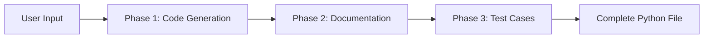

# 🤖 Quasi-Agent: Programmatic Prompting Practice

[](https://www.python.org/downloads/)
[](https://docs.litellm.ai/)

## 📋 Overview

The **Quasi-Agent** is an educational project that demonstrates the power of **programmatic prompting** and **context management** when working with Large Language Models (LLMs). While not a true agent (it can't react or adapt in real-time), it showcases how to build a useful system that can:

- ✍️ Generate Python functions based on user requirements
- 📚 Add comprehensive documentation automatically
- ✅ Create unit tests using Python's `unittest` framework

This project is part of the **AI Agents and Agentic AI with Python and Generative AI** course.

## 🎯 Learning Objectives

By studying and working with this code, you'll understand:

- 🔄 **Prompt Chaining**: Breaking complex tasks into sequential, manageable steps
- 🧠 **Context Management**: Maintaining memory across multiple LLM interactions
- 🔧 **Output Processing**: Parsing and cleaning LLM responses for reuse
- 📈 **Progressive Enhancement**: Building features iteratively (code → docs → tests)

## 🏗️ Architecture

The quasi-agent operates in three distinct phases:



### Phase 1: Initial Code Generation
- Takes user description of desired functionality
- LLM generates basic Python function
- Extracts code block from response

### Phase 2: Documentation Enhancement
- Takes the generated code
- Adds comprehensive docstrings including:
  - Function description
  - Parameter specifications
  - Return value documentation
  - Usage examples
  - Edge cases

### Phase 3: Test Case Creation
- Takes documented function
- Generates `unittest` test cases covering:
  - Basic functionality
  - Edge cases
  - Error scenarios
  - Various input types

## 🚀 Getting Started

### Prerequisites

- Python 3.12 or higher
- A Groq API key (or modify to use OpenAI/other providers)

### Installation

1. **Clone the repository**

```bash
git clone https://github.com/MohamedAliZouariEng/AI-Agents-and-Agentic-AI-with-Python-and-Generative-AI.git
cd AI-Agents-and-Agentic-AI-with-Python-and-Generative-AI/Module1_Agentic_AI_Concepts/Quasi-Agent
```

2. **Create and activate a virtual environment**

```bash
# On Linux
python3 -m venv venv
source venv/bin/activate
```

3. **Install dependencies**

```bash
pip install -r requirements.txt
```

4. **Set up environment variables**

Create a `.env` file in the `Quasi-Agent/` directory:

```bash
# .env
GROQ_API_KEY=your_groq_api_key_here
```

> 💡 **Get a Groq API key**: Visit [Groq Console](https://console.groq.com/) to sign up and get your free API key.


## 📁 Project Structure

```
Quasi-Agent/
├── Quasi-Agent.ipynb          # Main Jupyter notebook with code and explanations
├── requirements.txt           # Python dependencies
├── .env                       # Environment variables (create this)
├── square_root_of_100.py      # Example generated output
└── README.md                  # This file
```

## 🎮 Usage Example

```bash
What kind of function would you like to create?
Example: 'A function that calculates the factorial of a number'
Your description: calculate the square root of a number

=== Initial Function ===
def calculate_square_root(number):
    return math.sqrt(number)

=== Documented Function ===
def calculate_square_root(number: float) -> float:
    """
    Calculate the square root of a given number.
    
    Args:
        number (float): The number to calculate square root for
        
    Returns:
        float: The square root of the input number
        
    Raises:
        ValueError: If number is negative
        
    Examples:
        >>> calculate_square_root(16)
        4.0
    """
    ...

=== Test Cases ===
class TestCalculateSquareRoot(unittest.TestCase):
    def test_positive_numbers(self):
        self.assertEqual(calculate_square_root(16), 4.0)
    ...

Final code has been saved to calculate_the_square_root.py
```

## 🔑 Key Concepts Demonstrated

### Memory Management Through Message History

```python
messages = [
    {"role": "system", "content": "You are a Python expert..."},
    {"role": "user", "content": "Write a function that..."},
    {"role": "assistant", "content": "```python\n...code...\n```"},
    {"role": "user", "content": "Add documentation to this function..."}
]
```

### Code Extraction

```python
def extract_code_block(response: str) -> str:
    """Extract just the code from LLM response, removing commentary"""
    if '```' not in response:
        return response
    code_block = response.split('```')[1].strip()
    if code_block.startswith("python"):
        code_block = code_block[6:]
    return code_block
```

## 🧪 Running Generated Tests

After the quasi-agent generates a function with tests, you can run the tests:

```bash
python generated_function_name.py
```

## 📚 References

- **[Course Link](https://www.coursera.org/learn/ai-agents-python)** - AI Agents and Agentic AI with Python and Generative AI on Coursera
- [LiteLLM Documentation](https://docs.litellm.ai/) - Unified interface for LLM APIs
- [Groq Console](https://console.groq.com/) - Get your free API key
